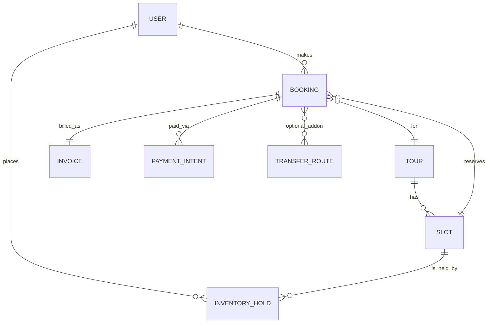
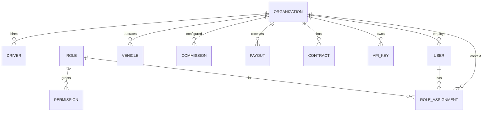
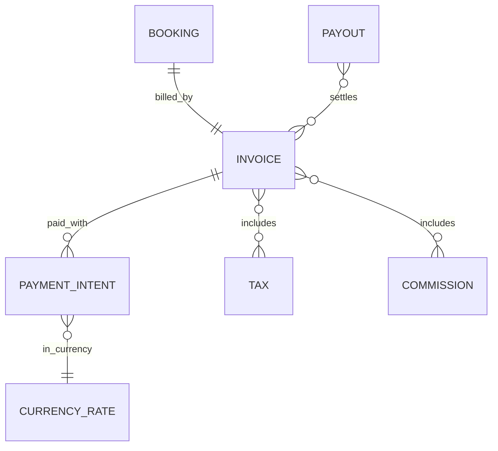
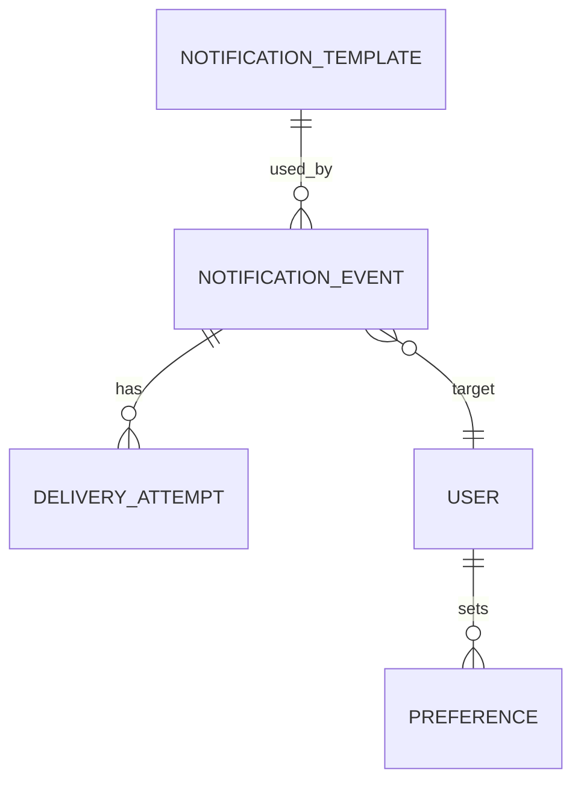
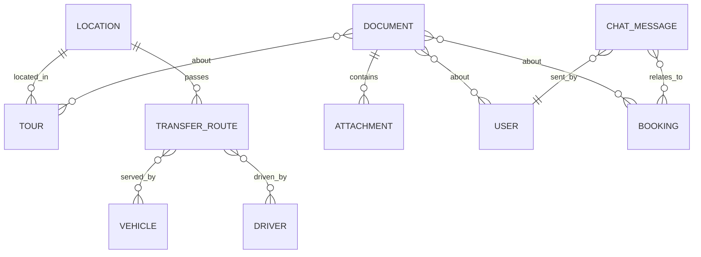
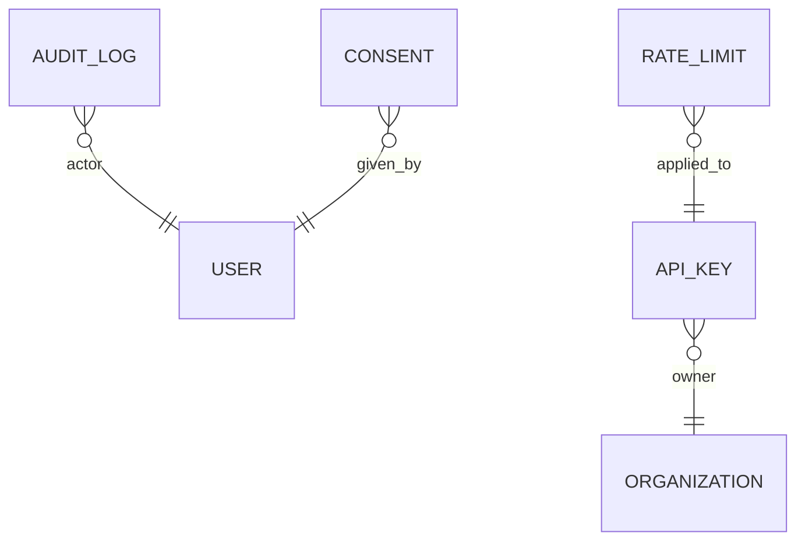
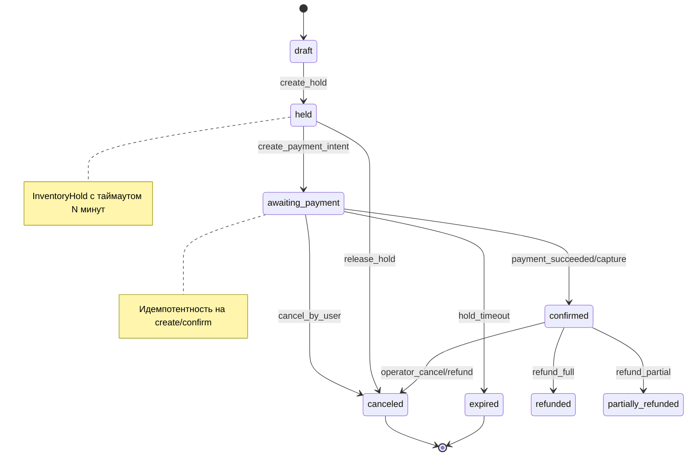
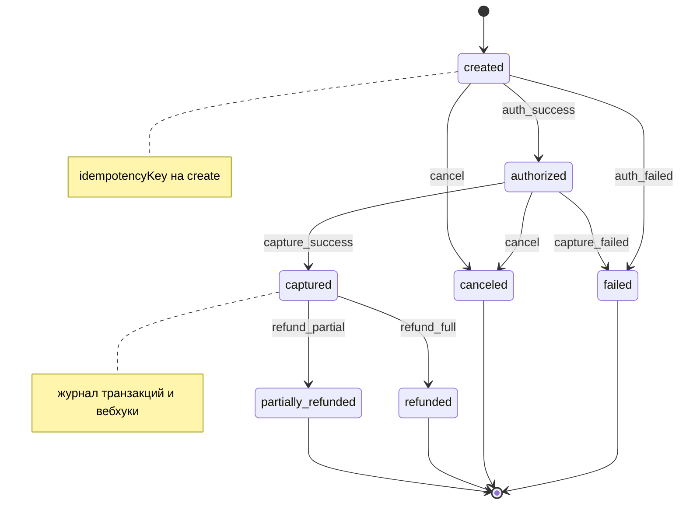

# ERD и статусные машины (Mermaid)

Актуально на: 2025-10-16

---

## ERD — Core Booking Domain

---

## ERD — Organizations & RBAC

---

## ERD — Payments & Finance

---

## ERD — Notifications

---

## ERD — Transport & Geo & Content

---

## ERD — Security & Compliance

---

## Словарь сущностей (минимальный)

- USER: аккаунт пользователя (PII, роли).
- ORGANIZATION: Operator | Transfer | Agent.
- ROLE, PERMISSION, ROLE_ASSIGNMENT: управление доступом.
- TOUR, SLOT, INVENTORY_HOLD, BOOKING: каталог и процесс бронирования.
- INVOICE, PAYMENT_INTENT, PAYOUT, COMMISSION, TAX, CURRENCY_RATE: финансы.
- NOTIFICATION_TEMPLATE, NOTIFICATION_EVENT, DELIVERY_ATTEMPT, PREFERENCE: уведомления.
- VEHICLE, DRIVER, TRANSFER_ROUTE: домен трансферов.
- LOCATION: нормализованная география.
- DOCUMENT, ATTACHMENT, CHAT_MESSAGE: контент и коммуникации.
- AUDIT_LOG, API_KEY, RATE_LIMIT, CONSENT: безопасность и комплаенс.

---

## Статусная машина — Booking

---

## Статусная машина — PaymentIntent

---

## Примечания по реализации

- Держите статусные переходы на стороне сервера с сохранением истории (AuditLog).
- Все операции оплаты — идемпотентные (по ключу), вебхуки — с верификацией сигнатур.
- Удержание инвентаря (InventoryHold) освобождается по таймауту или после успешного капчара.
- Для масштабируемости уведомлений — очередь, ретраи и дедупликация по eventId.
