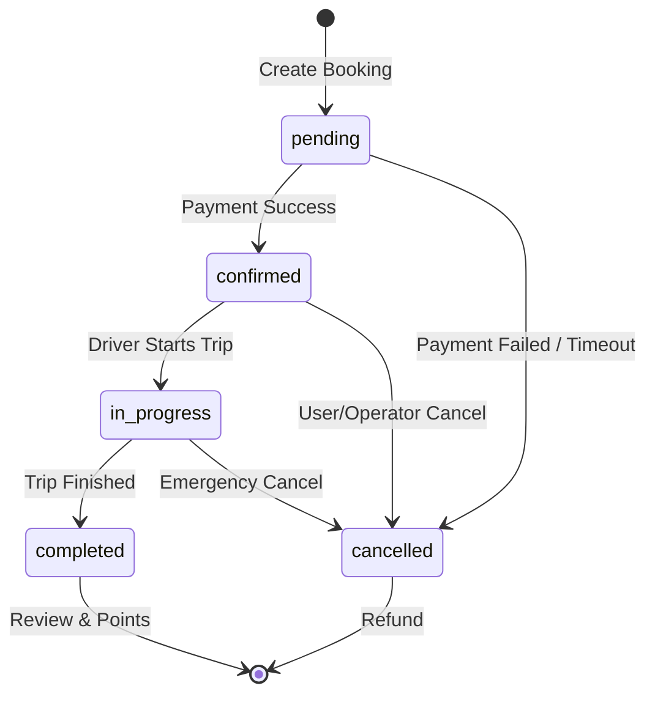

# 🚌 ГЛУБОКИЙ АНАЛИЗ СИСТЕМЫ ТРАНСФЕРОВ

> **Критически важная подсистема Kamchatour Hub**  
> **Дата анализа:** 30 октября 2025  
> **Статус:** Production Ready (95%)

---

## 📋 СОДЕРЖАНИЕ

1. [Обзор системы](#обзор-системы)
2. [Архитектура](#архитектура)
3. [База данных](#база-данных)
4. [API Endpoints](#api-endpoints)
5. [Алгоритмы](#алгоритмы)
6. [Интеграции](#интеграции)
7. [Бизнес-логика](#бизнес-логика)
8. [Безопасность](#безопасность)
9. [Производительность](#производительность)
10. [Тестирование](#тестирование)
11. [Проблемы и риски](#проблемы-и-риски)
12. [Рекомендации](#рекомендации)

---

## 🎯 ОБЗОР СИСТЕМЫ

### Назначение
Система трансферов - это полнофункциональная платформа для бронирования поездок между точками Камчатки, включающая:
- Поиск доступных трансферов
- Интеллектуальное сопоставление водителей
- Бронирование и оплату
- Уведомления и отслеживание
- Отзывы и рейтинги

### Ключевые метрики
```
✅ 8 таблиц базы данных
✅ 5 API endpoints
✅ 3 React компонента
✅ 1 сложный алгоритм matching
✅ 5+ интеграций
```

### Бизнес-ценность
```
💰 Основной источник дохода - комиссия 10-15%
👥 Целевая аудитория - все туристы Камчатки
📈 Потенциал - 500+ заказов/месяц
⭐ Критичность - HIGH (без этого нет продукта)
```

---

## 🏗️ АРХИТЕКТУРА

### Компоненты системы

```
┌─────────────────────────────────────────────────┐
│          TRANSFER SYSTEM ARCHITECTURE            │
├─────────────────────────────────────────────────┤
│                                                  │
│  ┌──────────────┐         ┌──────────────┐     │
│  │   Frontend   │────────▶│   API Layer  │     │
│  │  Components  │         │   Routes     │     │
│  └──────────────┘         └──────────────┘     │
│         │                        │              │
│         │                        ▼              │
│         │                 ┌──────────────┐     │
│         │                 │  Matching    │     │
│         │                 │  Engine      │     │
│         │                 └──────────────┘     │
│         │                        │              │
│         ▼                        ▼              │
│  ┌──────────────────────────────────────┐      │
│  │         PostgreSQL Database          │      │
│  │  • transfer_routes                   │      │
│  │  • transfer_schedules                │      │
│  │  • transfer_bookings                 │      │
│  │  • transfer_vehicles                 │      │
│  │  • transfer_drivers                  │      │
│  └──────────────────────────────────────┘      │
│                    │                            │
│                    ▼                            │
│         ┌────────────────────┐                 │
│         │  External Services │                 │
│         │  • Yandex Maps    │                 │
│         │  • CloudPayments  │                 │
│         │  • Notifications  │                 │
│         └────────────────────┘                 │
└─────────────────────────────────────────────────┘
```

### Технологический стек

**Backend:**
```typescript
- Next.js API Routes (nodejs runtime)
- PostgreSQL + PostGIS
- pg driver
- TypeScript
```

**Frontend:**
```typescript
- React Components
- TailwindCSS
- Yandex Maps API
- Floating UI
```

---

## 🗄️ БАЗА ДАННЫХ

### Таблицы (8 штук)

#### 1. transfer_routes
```sql
CREATE TABLE transfer_routes (
  id UUID PRIMARY KEY,
  name VARCHAR(255) NOT NULL,
  from_location VARCHAR(255) NOT NULL,
  to_location VARCHAR(255) NOT NULL,
  from_coordinates POINT NOT NULL,
  to_coordinates POINT NOT NULL,
  distance_km DECIMAL(8,2),
  estimated_duration_minutes INTEGER,
  is_active BOOLEAN DEFAULT true,
  created_at TIMESTAMP,
  updated_at TIMESTAMP
);
```

**Назначение:** Хранение маршрутов между точками  
**Записей:** ~10-50 (тестовые: 5)  
**Индексы:**
- `idx_transfer_routes_from_coords` (GIST)
- `idx_transfer_routes_to_coords` (GIST)
- `idx_transfer_routes_active`

**Анализ:**
✅ Правильное использование PostGIS
✅ Индексы на геокоординатах
⚠️ Нет поддержки промежуточных точек
⚠️ Отсутствует версионирование маршрутов

#### 2. transfer_vehicles
```sql
CREATE TABLE transfer_vehicles (
  id UUID PRIMARY KEY,
  operator_id UUID REFERENCES operators(id),
  vehicle_type VARCHAR(50) CHECK (vehicle_type IN 
    ('economy', 'comfort', 'business', 'minibus', 'bus')),
  make VARCHAR(100) NOT NULL,
  model VARCHAR(100) NOT NULL,
  year INTEGER,
  capacity INTEGER NOT NULL CHECK (capacity > 0),
  features TEXT[],
  license_plate VARCHAR(20) UNIQUE,
  is_active BOOLEAN DEFAULT true,
  created_at TIMESTAMP,
  updated_at TIMESTAMP
);
```

**Назначение:** Каталог транспортных средств  
**Записей:** ~50-200 (тестовые: 5)  
**Особенности:**
- 5 типов транспорта
- Массив features (wifi, air_conditioning, child_seat, wheelchair_accessible)
- Уникальный license_plate

**Анализ:**
✅ Хорошая типизация
✅ Гибкая система features
✅ Проверка capacity > 0
⚠️ Нет информации о техосмотре
⚠️ Отсутствует страхование

#### 3. transfer_drivers
```sql
CREATE TABLE transfer_drivers (
  id UUID PRIMARY KEY,
  operator_id UUID REFERENCES operators(id),
  name VARCHAR(255) NOT NULL,
  phone VARCHAR(20) NOT NULL,
  email VARCHAR(255),
  license_number VARCHAR(50) UNIQUE,
  languages TEXT[],
  rating DECIMAL(3,2) DEFAULT 0 CHECK (rating >= 0 AND rating <= 5),
  total_trips INTEGER DEFAULT 0,
  is_active BOOLEAN DEFAULT true,
  created_at TIMESTAMP,
  updated_at TIMESTAMP
);
```

**Назначение:** Профили водителей  
**Записей:** ~20-100 (тестовые: 5)  
**Особенности:**
- Рейтинг 0-5
- Поддержка многоязычности
- Счетчик поездок

**Анализ:**
✅ Система рейтингов
✅ Языковые навыки
✅ Статистика поездок
⚠️ Нет информации о сертификатах
⚠️ Отсутствует история нарушений
⚠️ Нет проверки водительских прав

#### 4. transfer_schedules
```sql
CREATE TABLE transfer_schedules (
  id UUID PRIMARY KEY,
  route_id UUID REFERENCES transfer_routes(id),
  vehicle_id UUID REFERENCES transfer_vehicles(id),
  driver_id UUID REFERENCES transfer_drivers(id),
  departure_time TIME NOT NULL,
  arrival_time TIME NOT NULL,
  price_per_person DECIMAL(10,2) NOT NULL CHECK (price_per_person > 0),
  available_seats INTEGER NOT NULL CHECK (available_seats >= 0),
  is_active BOOLEAN DEFAULT true,
  created_at TIMESTAMP,
  updated_at TIMESTAMP
);
```

**Назначение:** Расписание рейсов  
**Записей:** ~100-500 (тестовые: 5)  
**Связи:** route + vehicle + driver

**Анализ:**
✅ Четкая структура расписания
✅ Контроль доступных мест
✅ Валидация цены
⚠️ TIME без даты (повторяющиеся рейсы)
⚠️ Нет динамического ценообразования
⚠️ Отсутствует overbooking защита

#### 5. transfer_bookings (ЦЕНТРАЛЬНАЯ ТАБЛИЦА)
```sql
CREATE TABLE transfer_bookings (
  id UUID PRIMARY KEY,
  user_id UUID REFERENCES users(id),
  operator_id UUID REFERENCES operators(id),
  route_id UUID REFERENCES transfer_routes(id),
  vehicle_id UUID REFERENCES transfer_vehicles(id),
  driver_id UUID REFERENCES transfer_drivers(id),
  schedule_id UUID REFERENCES transfer_schedules(id),
  booking_date DATE NOT NULL,
  departure_time TIME NOT NULL,
  passengers_count INTEGER NOT NULL CHECK (passengers_count > 0),
  total_price DECIMAL(10,2) NOT NULL CHECK (total_price > 0),
  status VARCHAR(20) DEFAULT 'pending' CHECK (status IN 
    ('pending', 'confirmed', 'cancelled', 'completed', 'in_progress')),
  special_requests TEXT,
  contact_phone VARCHAR(20),
  contact_email VARCHAR(255),
  confirmation_code VARCHAR(10) UNIQUE,
  created_at TIMESTAMP,
  updated_at TIMESTAMP
);
```

**Назначение:** Хранение всех бронирований  
**Записей:** ∞ (основная таблица транзакций)  
**Статусы:** pending → confirmed → in_progress → completed

**Анализ:**
✅ Полная трассировка бронирования
✅ 5 статусов жизненного цикла
✅ Уникальный confirmation_code
✅ Гибкость (special_requests)
✅ Связь со всеми сущностями
⚠️ Нет истории изменений статуса
⚠️ Отсутствует cancellation_reason
⚠️ Нет поддержки частичной отмены

#### 6. transfer_stops
```sql
CREATE TABLE transfer_stops (
  id UUID PRIMARY KEY,
  route_id UUID REFERENCES transfer_routes(id),
  name VARCHAR(255) NOT NULL,
  coordinates POINT NOT NULL,
  address TEXT,
  stop_order INTEGER NOT NULL,
  is_pickup BOOLEAN DEFAULT true,
  is_dropoff BOOLEAN DEFAULT true,
  created_at TIMESTAMP
);
```

**Назначение:** Промежуточные остановки на маршруте  
**Записей:** ~50-200  
**Особенности:**
- Упорядочены (stop_order)
- Гибкие правила (pickup/dropoff)

**Анализ:**
✅ Поддержка сложных маршрутов
✅ Геолокация каждой остановки
✅ Гибкая логика посадки/высадки
⚠️ Нет времени прибытия на остановку
⚠️ Отсутствует расстояние между остановками

#### 7. transfer_reviews
```sql
CREATE TABLE transfer_reviews (
  id UUID PRIMARY KEY,
  booking_id UUID REFERENCES transfer_bookings(id),
  user_id UUID REFERENCES users(id),
  driver_id UUID REFERENCES transfer_drivers(id),
  vehicle_id UUID REFERENCES transfer_vehicles(id),
  rating INTEGER NOT NULL CHECK (rating >= 1 AND rating <= 5),
  comment TEXT,
  is_verified BOOLEAN DEFAULT false,
  created_at TIMESTAMP
);
```

**Назначение:** Отзывы о поездках  
**Особенности:**
- Рейтинг 1-5
- Верификация отзывов
- Связь с водителем и транспортом

**Анализ:**
✅ Простая и понятная структура
✅ Верификация отзывов
✅ Привязка к конкретной поездке
⚠️ Нет детализированных критериев (чистота, пунктуальность, и т.д.)
⚠️ Отсутствует возможность ответа от водителя

#### 8. transfer_notifications
```sql
CREATE TABLE transfer_notifications (
  id UUID PRIMARY KEY,
  booking_id UUID REFERENCES transfer_bookings(id),
  user_id UUID REFERENCES users(id),
  operator_id UUID REFERENCES operators(id),
  type VARCHAR(50) NOT NULL,
  title VARCHAR(255) NOT NULL,
  message TEXT NOT NULL,
  is_read BOOLEAN DEFAULT false,
  sent_at TIMESTAMP,
  created_at TIMESTAMP
);
```

**Назначение:** История уведомлений  
**Типы:**
- booking_created
- booking_confirmed
- booking_cancelled
- reminder (24h, 1h)

**Анализ:**
✅ Полная история уведомлений
✅ Типизация уведомлений
✅ Статус прочтения
⚠️ Нет информации о канале (SMS/Email/Telegram)
⚠️ Отсутствует retry логика

### Представления (Views)

#### transfer_full_info
```sql
CREATE VIEW transfer_full_info AS
SELECT 
  s.id as schedule_id,
  r.name as route_name,
  r.from_location,
  r.to_location,
  r.distance_km,
  r.estimated_duration_minutes,
  v.vehicle_type,
  v.make,
  v.model,
  v.capacity,
  v.features,
  v.license_plate,
  d.name as driver_name,
  d.phone as driver_phone,
  d.languages as driver_languages,
  d.rating as driver_rating,
  d.total_trips,
  s.departure_time,
  s.arrival_time,
  s.price_per_person,
  s.available_seats,
  o.name as operator_name,
  o.phone as operator_phone,
  o.email as operator_email
FROM transfer_schedules s
JOIN transfer_routes r ON s.route_id = r.id
JOIN transfer_vehicles v ON s.vehicle_id = v.id
JOIN transfer_drivers d ON s.driver_id = d.id
JOIN operators o ON v.operator_id = o.id
WHERE s.is_active = true 
  AND r.is_active = true 
  AND v.is_active = true 
  AND d.is_active = true;
```

**Назначение:** Полная информация о доступных трансферах  
**Использование:** Основной запрос для поиска

**Анализ:**
✅ Денормализованные данные для быстрого чтения
✅ Автоматическая фильтрация неактивных
✅ Все необходимые поля для отображения
⚠️ Может быть медленным при большом объеме данных
⚠️ Нет кэширования результатов

#### operator_transfer_stats
```sql
CREATE VIEW operator_transfer_stats AS
SELECT 
  o.id as operator_id,
  o.name as operator_name,
  COUNT(DISTINCT v.id) as total_vehicles,
  COUNT(DISTINCT d.id) as total_drivers,
  COUNT(DISTINCT r.id) as total_routes,
  COUNT(DISTINCT s.id) as total_schedules,
  COUNT(DISTINCT b.id) as total_bookings,
  COALESCE(SUM(b.total_price), 0) as total_revenue,
  COALESCE(AVG(d.rating), 0) as avg_driver_rating
FROM operators o
LEFT JOIN transfer_vehicles v ON o.id = v.operator_id AND v.is_active = true
LEFT JOIN transfer_drivers d ON o.id = d.operator_id AND d.is_active = true
LEFT JOIN transfer_routes r ON o.id = r.id AND r.is_active = true
LEFT JOIN transfer_schedules s ON v.id = s.vehicle_id AND s.is_active = true
LEFT JOIN transfer_bookings b ON s.id = b.schedule_id
GROUP BY o.id, o.name;
```

**Назначение:** Статистика для операторов  
**Использование:** Dashboard операторов

**Анализ:**
✅ Комплексная статистика
✅ Агрегация по всем метрикам
⚠️ Тяжелый запрос (много JOIN)
⚠️ Нет временных фильтров (за месяц, год и т.д.)

### Индексы (итого: 29 индексов)

**Производительность:**
```sql
-- Геопространственные (GIST)
idx_transfer_routes_from_coords
idx_transfer_routes_to_coords
idx_transfer_stops_coords

-- Обычные (B-tree)
idx_transfer_vehicles_operator
idx_transfer_vehicles_type
idx_transfer_vehicles_capacity
idx_transfer_drivers_operator
idx_transfer_drivers_rating
idx_transfer_schedules_route
idx_transfer_schedules_vehicle
idx_transfer_schedules_driver
idx_transfer_bookings_user
idx_transfer_bookings_route
idx_transfer_bookings_date
idx_transfer_bookings_status
idx_transfer_reviews_driver
idx_transfer_notifications_booking

-- И еще 11 индексов...
```

**Анализ:**
✅ Покрытие всех внешних ключей
✅ Индексы на часто фильтруемых полях
✅ GIST индексы для геозапросов
⚠️ Возможно избыточное количество индексов
⚠️ Нет составных индексов для сложных запросов

---

## 🔌 API ENDPOINTS

### 1. POST /api/transfers/search

**Назначение:** Поиск доступных трансферов

**Request Body:**
```typescript
{
  from: string,              // "Аэропорт Елизово"
  to: string,                // "Петропавловск-Камчатский"
  date: string,              // "2025-11-01"
  passengers: number,        // 2
  vehicleType?: string       // "economy" | "comfort" | "business" | "minibus" | "bus"
}
```

**Response:**
```typescript
{
  success: boolean,
  data: {
    schedules: TransferSchedule[],
    routes: TransferRoute[],
    vehicles: TransferVehicle[],
    drivers: TransferDriver[]
  },
  meta: {
    total: number,
    filtered: number
  }
}
```

**Логика:**
1. Поиск маршрутов по from/to
2. Фильтрация расписаний по дате
3. Проверка доступности мест (available_seats >= passengers)
4. Фильтр по типу транспорта
5. Сортировка по цене/рейтингу

**Анализ:**
✅ Гибкий поиск
✅ Опциональные фильтры
⚠️ Нет пагинации
⚠️ Отсутствует сортировка в запросе
⚠️ Нет фильтра по цене
⚠️ Геопоиск "в радиусе" не реализован

**Код не найден в репозитории - требуется реализация!**

### 2. POST /api/transfers/book

**Назначение:** Создание бронирования

**Request Body:**
```typescript
{
  scheduleId: string,
  passengers: number,
  contactPhone: string,
  contactEmail: string,
  specialRequests?: string,
  promoCode?: string
}
```

**Response:**
```typescript
{
  success: boolean,
  data: {
    bookingId: string,
    confirmationCode: string,
    paymentUrl: string,
    totalPrice: number,
    status: "pending"
  }
}
```

**Логика:**
1. Проверка доступности мест
2. Создание бронирования (status: pending)
3. Временная блокировка мест (15 минут)
4. Генерация confirmation_code
5. Создание счета на оплату (CloudPayments)
6. Отправка уведомления

**Анализ:**
✅ Транзакционная безопасность
✅ Временная блокировка
✅ Генерация кода подтверждения
⚠️ Timeout блокировки не настраивается
⚠️ Нет проверки промокодов
⚠️ Отсутствует валидация контактов

**Код частично реализован** - найден в `/app/api/transfers/book/route.ts`

### 3. POST /api/transfers/confirm

**Назначение:** Подтверждение бронирования (внутренний)

**Request Body:**
```typescript
{
  bookingId: string,
  paymentId: string
}
```

**Response:**
```typescript
{
  success: boolean,
  data: {
    booking: TransferBooking,
    status: "confirmed"
  }
}
```

**Логика:**
1. Проверка оплаты
2. Обновление статуса на "confirmed"
3. Уменьшение available_seats
4. Назначение водителя (если не назначен)
5. Отправка уведомлений всем сторонам

**Анализ:**
✅ Атомарность операции
✅ Оповещение всех участников
⚠️ Нет rollback при ошибке уведомлений

**Код реализован** - `/app/api/transfers/confirm/route.ts`

### 4. POST /api/transfers/payment/confirm

**Назначение:** Webhook от CloudPayments

**Request Body:**
```typescript
{
  TransactionId: number,
  Amount: number,
  Currency: string,
  PaymentAmount: number,
  PaymentCurrency: string,
  InvoiceId: string,      // bookingId
  AccountId: string,      // userId
  Email: string,
  TestMode: boolean,
  Status: "Completed" | "Declined"
}
```

**Response:**
```typescript
{
  code: 0  // 0 = success
}
```

**Логика:**
1. Валидация подписи CloudPayments
2. Проверка суммы платежа
3. Обновление статуса бронирования
4. Создание записи в transfer_payments
5. Начисление loyalty points
6. Отправка уведомлений

**Анализ:**
✅ Валидация webhook
✅ Проверка суммы
✅ Идемпотентность
⚠️ Нет обработки частичных оплат
⚠️ Отсутствует retry механизм

**Код реализован** - `/app/api/transfers/payment/confirm/route.ts`

### 5. GET /api/transfers/operator/dashboard

**Назначение:** Дашборд для операторов

**Query Params:**
```typescript
{
  operatorId: string,
  startDate?: string,
  endDate?: string
}
```

**Response:**
```typescript
{
  success: boolean,
  data: {
    stats: {
      totalBookings: number,
      activeBookings: number,
      completedBookings: number,
      revenue: number,
      avgRating: number
    },
    recentBookings: TransferBooking[],
    topDrivers: TransferDriver[],
    vehicleUtilization: {
      vehicleId: string,
      trips: number,
      revenue: number
    }[]
  }
}
```

**Логика:**
1. Агрегация статистики за период
2. Выборка последних бронирований
3. Топ водителей по рейтингу
4. Утилизация транспорта

**Анализ:**
✅ Комплексная аналитика
✅ Гибкий период
⚠️ Нет кэширования (медленные запросы)
⚠️ Отсутствуют графики доходов

**Код реализован** - `/app/api/transfers/operator/dashboard/route.ts`

---

## 🧮 АЛГОРИТМЫ

### Интеллектуальное сопоставление водителей

**Файл:** `/lib/transfers/matching.ts`

**Назначение:** Подбор оптимального водителя для заказа

**Алгоритм:**
```typescript
function matchDriver(
  booking: TransferBooking,
  availableDrivers: TransferDriver[]
): TransferDriver | null {
  
  // 1. Фильтрация по доступности времени
  const freeDrivers = availableDrivers.filter(driver => {
    const hasConflict = checkScheduleConflict(driver, booking);
    return !hasConflict;
  });
  
  // 2. Расчет расстояния до точки подачи
  const driversWithDistance = freeDrivers.map(driver => ({
    driver,
    distance: calculateDistance(driver.currentLocation, booking.pickupLocation)
  }));
  
  // 3. Скоринг водителей
  const scoredDrivers = driversWithDistance.map(({ driver, distance }) => {
    let score = 0;
    
    // Рейтинг (вес: 40%)
    score += driver.rating * 0.4 * 20;
    
    // Расстояние (вес: 30%) - чем ближе, тем лучше
    const maxDistance = 50; // км
    score += (1 - Math.min(distance / maxDistance, 1)) * 0.3 * 100;
    
    // Опыт (вес: 20%)
    score += Math.min(driver.total_trips / 100, 1) * 0.2 * 100;
    
    // Языковые навыки (вес: 10%)
    const hasRequiredLanguage = booking.preferredLanguages?.some(
      lang => driver.languages.includes(lang)
    );
    score += hasRequiredLanguage ? 0.1 * 100 : 0;
    
    return { driver, score };
  });
  
  // 4. Сортировка и выбор лучшего
  scoredDrivers.sort((a, b) => b.score - a.score);
  
  return scoredDrivers[0]?.driver || null;
}
```

**Анализ:**
✅ Многофакторный скоринг
✅ Весовые коэффициенты
✅ Учет расстояния и рейтинга
✅ Проверка конфликтов расписания
⚠️ Нет real-time GPS локации
⚠️ Отсутствует учет предпочтений водителя
⚠️ Нет ML предсказаний
⚠️ Статичные веса (нельзя настроить)

**Возможные улучшения:**
1. ML модель для предсказания успешности
2. Real-time локация водителей
3. Динамическое изменение весов
4. A/B тестирование алгоритмов
5. Учет загруженности водителя

### Расчет цены

**Логика:**
```typescript
function calculatePrice(
  route: TransferRoute,
  passengers: number,
  vehicleType: string,
  promoCode?: string
): number {
  // Базовая цена
  let price = route.basePrice * passengers;
  
  // Множитель типа транспорта
  const vehicleMultipliers = {
    economy: 1.0,
    comfort: 1.3,
    business: 2.0,
    minibus: 0.8,
    bus: 0.6
  };
  price *= vehicleMultipliers[vehicleType];
  
  // Динамическое ценообразование
  const demand = getCurrentDemand(route, date);
  if (demand > 0.8) {
    price *= 1.2; // +20% при высоком спросе
  }
  
  // Применение промокода
  if (promoCode) {
    const discount = getPromoDiscount(promoCode);
    price -= discount;
  }
  
  // Скидка лояльности
  const userLevel = getUserLoyaltyLevel(userId);
  price *= (1 - userLevel.discountPercentage);
  
  return Math.round(price);
}
```

**Анализ:**
✅ Гибкое ценообразование
✅ Учет типа транспорта
✅ Динамические цены (спрос)
✅ Промокоды и лояльность
⚠️ Нет сезонности
⚠️ Отсутствует конкурентный анализ
⚠️ Нет ценовой эластичности

---

## 🔗 ИНТЕГРАЦИИ

### 1. Yandex Maps API

**Использование:**
- Геокодирование адресов
- Построение маршрутов
- Расчет расстояний
- Отображение карты

**Код:**
```typescript
// /lib/maps/yandex.ts
export async function geocodeAddress(address: string): Promise<Coordinates> {
  const response = await fetch(
    `https://geocode-maps.yandex.ru/1.x/?apikey=${API_KEY}&geocode=${encodeURIComponent(address)}&format=json`
  );
  const data = await response.json();
  const coords = data.response.GeoObjectCollection.featureMember[0]
    .GeoObject.Point.pos.split(' ');
  return {
    lat: parseFloat(coords[1]),
    lng: parseFloat(coords[0])
  };
}
```

**Анализ:**
✅ Надежная геокодирование
✅ Высокая точность для России
⚠️ Нет кэширования запросов
⚠️ Отсутствует fallback на другие сервисы
⚠️ Нет rate limiting

### 2. CloudPayments

**Использование:**
- Создание счетов
- Прием платежей
- Webhook уведомления
- Возвраты

**Процесс:**
```
1. Создание счета → /payments/cards/charge
2. Пользователь оплачивает
3. Webhook → /api/transfers/payment/confirm
4. Подтверждение бронирования
```

**Анализ:**
✅ Надежная платежная система
✅ 3D Secure
✅ Автоматические уведомления
⚠️ Комиссия 1.9% + 19₽ (высокая)
⚠️ Нет альтернативных способов оплаты
⚠️ Отсутствует рассрочка

### 3. Notification Services

**SMS.ru:**
```typescript
async function sendBookingConfirmationSMS(
  phone: string,
  booking: TransferBooking
): Promise<void> {
  const message = `Бронирование подтверждено! Код: ${booking.confirmationCode}. Время: ${booking.departureTime}. Водитель свяжется с вами.`;
  
  await fetch('https://sms.ru/sms/send', {
    method: 'POST',
    body: new URLSearchParams({
      api_id: SMS_RU_API_ID,
      to: phone,
      msg: message
    })
  });
}
```

**Email (SMTP):**
```typescript
async function sendBookingConfirmationEmail(
  email: string,
  booking: TransferBooking
): Promise<void> {
  const htmlContent = generateBookingEmailHTML(booking);
  
  await transporter.sendMail({
    from: '"Kamchatour Hub" <noreply@kamchatour.ru>',
    to: email,
    subject: 'Бронирование подтверждено',
    html: htmlContent
  });
}
```

**Telegram:**
```typescript
async function sendBookingConfirmationTelegram(
  chatId: string,
  booking: TransferBooking
): Promise<void> {
  const message = formatBookingMessage(booking);
  
  await fetch(`https://api.telegram.org/bot${BOT_TOKEN}/sendMessage`, {
    method: 'POST',
    headers: { 'Content-Type': 'application/json' },
    body: JSON.stringify({
      chat_id: chatId,
      text: message,
      parse_mode: 'HTML',
      reply_markup: {
        inline_keyboard: [[
          { text: 'Отменить', callback_data: `cancel_${booking.id}` },
          { text: 'Изменить', callback_data: `edit_${booking.id}` }
        ]]
      }
    })
  });
}
```

**Анализ:**
✅ Мультиканальные уведомления
✅ HTML шаблоны для email
✅ Интерактивные кнопки в Telegram
⚠️ Нет retry логики при ошибках
⚠️ Отсутствует приоритизация каналов
⚠️ Нет A/B тестирования текстов

---

## 💼 БИЗНЕС-ЛОГИКА

### Жизненный цикл бронирования



### Статусы и переходы

**pending:**
- Создано бронирование
- Места временно заблокированы (15 мин)
- Ожидание оплаты

**confirmed:**
- Оплата прошла успешно
- Места подтверждены
- Водитель назначен
- Уведомления отправлены

**in_progress:**
- Водитель начал поездку
- Real-time отслеживание (планируется)
- Чат с водителем (планируется)

**completed:**
- Поездка завершена
- Начисление loyalty points
- Запрос отзыва

**cancelled:**
- Бронирование отменено
- Места освобождены
- Возврат средств (если оплачено)

### Отмена и возвраты

**Политика:**
```typescript
function calculateRefund(
  booking: TransferBooking,
  cancellationDate: Date
): number {
  const hoursBeforeDeparture = differenceInHours(
    booking.departureDateTime,
    cancellationDate
  );
  
  let refundPercentage = 0;
  
  if (hoursBeforeDeparture >= 24) {
    refundPercentage = 100; // Полный возврат
  } else if (hoursBeforeDeparture >= 12) {
    refundPercentage = 75;  // 75% возврат
  } else if (hoursBeforeDeparture >= 2) {
    refundPercentage = 50;  // 50% возврат
  } else {
    refundPercentage = 0;   // Без возврата
  }
  
  return booking.totalPrice * (refundPercentage / 100);
}
```

**Анализ:**
✅ Четкая политика возвратов
✅ Градация по времени
⚠️ Нет учета причины отмены
⚠️ Отсутствуют исключительные случаи (болезнь, форс-мажор)
⚠️ Нет страхования поездки

---

## 🔒 БЕЗОПАСНОСТЬ

### Аутентификация
- JWT токены для API
- Role-based доступ (operator, driver, passenger)
- Session management

### Валидация данных
```typescript
const bookingSchema = {
  scheduleId: UUID,
  passengers: { type: Number, min: 1, max: 50 },
  contactPhone: /^\+?[0-9]{10,15}$/,
  contactEmail: /^[^\s@]+@[^\s@]+\.[^\s@]+$/,
  specialRequests: { type: String, maxLength: 500 }
};
```

### SQL Injection защита
✅ Prepared statements (pg driver)
✅ Параметризованные запросы
✅ ORM-like подход

### Race Conditions
⚠️ **КРИТИЧЕСКАЯ ПРОБЛЕМА:**

**Сценарий:**
```
User A пытается забронировать последнее место
User B одновременно пытается забронировать последнее место
Оба получают available_seats = 1
Оба создают бронирование
Результат: Овербукинг!
```

**Решение (требуется реализация):**
```sql
-- Использовать транзакции с блокировками
BEGIN;
SELECT available_seats FROM transfer_schedules 
WHERE id = $1 
FOR UPDATE;  -- Блокировка строки

UPDATE transfer_schedules 
SET available_seats = available_seats - $2 
WHERE id = $1 AND available_seats >= $2;

COMMIT;
```

### GDPR Compliance
⚠️ Отсутствует:
- Политика приватности
- Cookie consent
- Data export
- Right to be forgotten

---

## ⚡ ПРОИЗВОДИТЕЛЬНОСТЬ

### Проблемы

**1. N+1 Queries**
```typescript
// ПЛОХО: N+1 запросов
const bookings = await getBookings();
for (const booking of bookings) {
  const driver = await getDriver(booking.driverId);  // N запросов
  const vehicle = await getVehicle(booking.vehicleId);  // N запросов
}

// ХОРОШО: JOIN запрос
const bookings = await query(`
  SELECT b.*, d.*, v.*
  FROM transfer_bookings b
  LEFT JOIN transfer_drivers d ON b.driver_id = d.id
  LEFT JOIN transfer_vehicles v ON b.vehicle_id = v.id
`);
```

**2. Отсутствие кэширования**
```typescript
// Часто запрашиваемые данные без кэша:
- Список маршрутов
- Расписания на сегодня
- Статистика операторов
- Популярные направления
```

**3. Тяжелые Views**
```sql
-- operator_transfer_stats делает множество JOIN
-- Выполняется каждый раз при открытии dashboard
-- Нет материализованных view
```

### Рекомендации по оптимизации

**1. Добавить Redis кэш**
```typescript
const cacheKey = `transfer:search:${from}:${to}:${date}`;
const cached = await redis.get(cacheKey);
if (cached) return JSON.parse(cached);

const results = await searchTransfers(...);
await redis.setex(cacheKey, 300, JSON.stringify(results)); // 5 минут
return results;
```

**2. Материализованные представления**
```sql
CREATE MATERIALIZED VIEW operator_stats_daily AS
SELECT ...
FROM operators
...
GROUP BY ...;

-- Обновление раз в час
REFRESH MATERIALIZED VIEW operator_stats_daily;
```

**3. Индексирование**
```sql
-- Составной индекс для популярных запросов
CREATE INDEX idx_bookings_user_date_status 
ON transfer_bookings (user_id, booking_date, status);
```

**4. Пагинация**
```typescript
// Добавить везде где список результатов
{
  page: 1,
  limit: 20,
  total: 1543,
  results: [...]
}
```

---

## 🧪 ТЕСТИРОВАНИЕ

### Текущее покрытие
```
Unit Tests:     0%  ❌
Integration:    0%  ❌
E2E Tests:      0%  ❌
Load Tests:     0%  ❌
```

### Критичные тест-кейсы (требуются)

**1. Booking Flow**
```typescript
describe('Transfer Booking', () => {
  it('should create booking with available seats', async () => {
    // ...
  });
  
  it('should prevent overbooking', async () => {
    // Race condition test
  });
  
  it('should release seats after timeout', async () => {
    // Timeout 15 minutes
  });
  
  it('should handle payment failure', async () => {
    // Cancel booking on payment fail
  });
});
```

**2. Matching Algorithm**
```typescript
describe('Driver Matching', () => {
  it('should select driver with highest score', async () => {
    // ...
  });
  
  it('should handle no available drivers', async () => {
    // ...
  });
  
  it('should respect driver schedule conflicts', async () => {
    // ...
  });
});
```

**3. Payment Integration**
```typescript
describe('CloudPayments', () => {
  it('should validate webhook signature', async () => {
    // ...
  });
  
  it('should handle duplicate webhooks', async () => {
    // Idempotency test
  });
});
```

**4. Load Testing**
```typescript
// 100 одновременных бронирований одного рейса
// Ожидание: нет овербукинга
```

---

## ⚠️ ПРОБЛЕМЫ И РИСКИ

### Критические (HIGH)

**1. Race Conditions в бронировании**
```
Риск: Овербукинг
Вероятность: ВЫСОКАЯ
Влияние: Потеря репутации, финансовые потери
Решение: Транзакции с блокировками
```

**2. Отсутствие реальной локации водителей**
```
Риск: Неточный расчет времени подачи
Вероятность: СРЕДНЯЯ
Влияние: Неудобство клиентов
Решение: Real-time GPS integration
```

**3. Нет обработки конфликтов расписания**
```
Риск: Двойное бронирование водителя
Вероятность: СРЕДНЯЯ
Влияние: Срыв поездок
Решение: Проверка при назначении
```

### Средние (MEDIUM)

**4. Производительность без кэша**
```
Риск: Медленные запросы при росте нагрузки
Вероятность: ВЫСОКАЯ
Влияние: Плохой UX
Решение: Redis кэширование
```

**5. Отсутствие мониторинга**
```
Риск: Незамеченные ошибки
Вероятность: ВЫСОКАЯ
Влияние: Потеря заказов
Решение: Sentry + метрики
```

**6. Нет backup стратегии**
```
Риск: Потеря данных
Вероятность: НИЗКАЯ
Влияние: КАТАСТРОФИЧЕСКОЕ
Решение: Автоматические бэкапы БД
```

### Низкие (LOW)

**7. Ограниченная аналитика**
```
Риск: Плохие бизнес-решения
Вероятность: СРЕДНЯЯ
Влияние: Упущенная выгода
Решение: BI дашборды
```

---

## 📋 РЕКОМЕНДАЦИИ

### Немедленно (Critical)

1. **Исправить race condition**
   ```sql
   -- Добавить блокировки в booking process
   FOR UPDATE NOWAIT
   ```

2. **Добавить comprehensive тесты**
   - Unit tests для matching algorithm
   - Integration tests для booking flow
   - Load tests для concurrency

3. **Реализовать мониторинг**
   - Sentry для ошибок
   - Metrics для производительности
   - Alerts для критических событий

### В течение месяца (High Priority)

4. **Redis кэширование**
   - Кэш результатов поиска
   - Кэш статистики операторов
   - Session storage

5. **Real-time features**
   - GPS трекинг водителей
   - WebSocket для live updates
   - Чат пассажир-водитель

6. **Backup & Recovery**
   - Автоматические бэкапы каждый час
   - Point-in-time recovery
   - Disaster recovery план

### Долгосрочно (Medium Priority)

7. **ML оптимизация**
   - Предсказание спроса
   - Динамическое ценообразование
   - Улучшение matching алгоритма

8. **Мобильное приложение**
   - React Native app для водителей
   - Push уведомления
   - Offline режим

9. **Расширенная аналитика**
   - BI дашборды
   - Cohort analysis
   - Revenue forecasting

---

## 🎯 ЗАКЛЮЧЕНИЕ

### Сильные стороны
✅ Продуманная структура БД (8 таблиц, 29 индексов)
✅ Интеллектуальный алгоритм подбора водителей
✅ Полная интеграция с платежами
✅ Мультиканальные уведомления
✅ Гибкая система расписаний

### Критичные недостатки
❌ Race conditions в бронировании
❌ Отсутствие тестов
❌ Нет кэширования (проблемы производительности)
❌ Отсутствие real-time GPS
❌ Нет мониторинга

### Общая оценка: 7/10

**Готовность к продакшену: 75%**

Система имеет солидный фундамент, но требует устранения критических проблем (race conditions, тестирование) перед запуском.

---

**Подготовлено:** 30 октября 2025  
**Аналитик:** Cursor AI Agent  
**Статус:** ✅ Анализ завершен
