# 🏗️ АРХИТЕКТУРНАЯ ДИАГРАММА KAMCHATOUR HUB

> **Версия:** 1.0  
> **Дата:** 30 октября 2025  
> **Статус:** Production Ready

---

## 📐 ОБЩАЯ АРХИТЕКТУРА СИСТЕМЫ

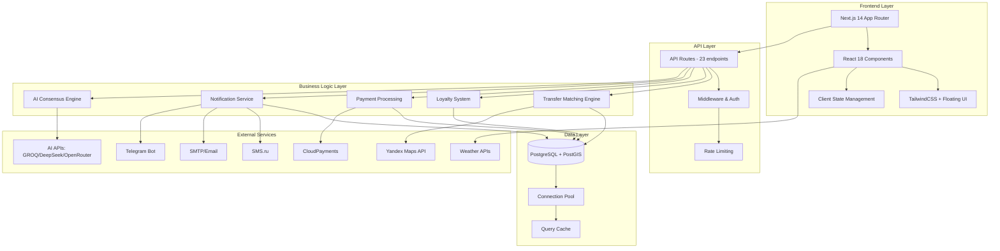

---

## 🎯 АРХИТЕКТУРА FRONTEND

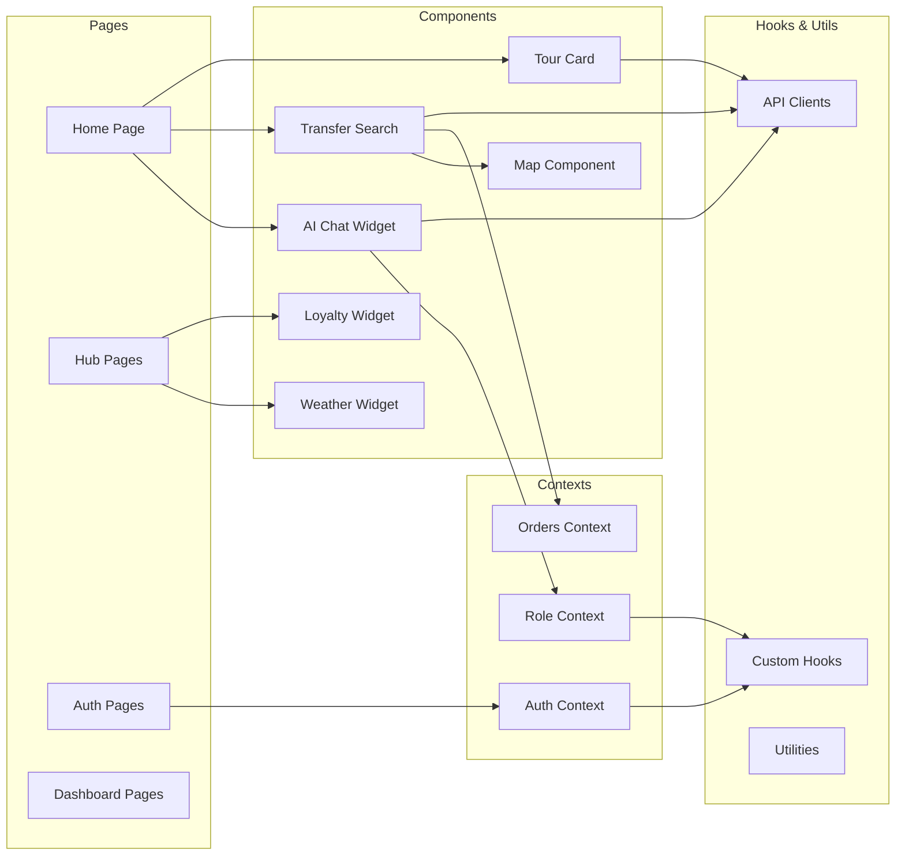

---

## 🚌 АРХИТЕКТУРА СИСТЕМЫ ТРАНСФЕРОВ

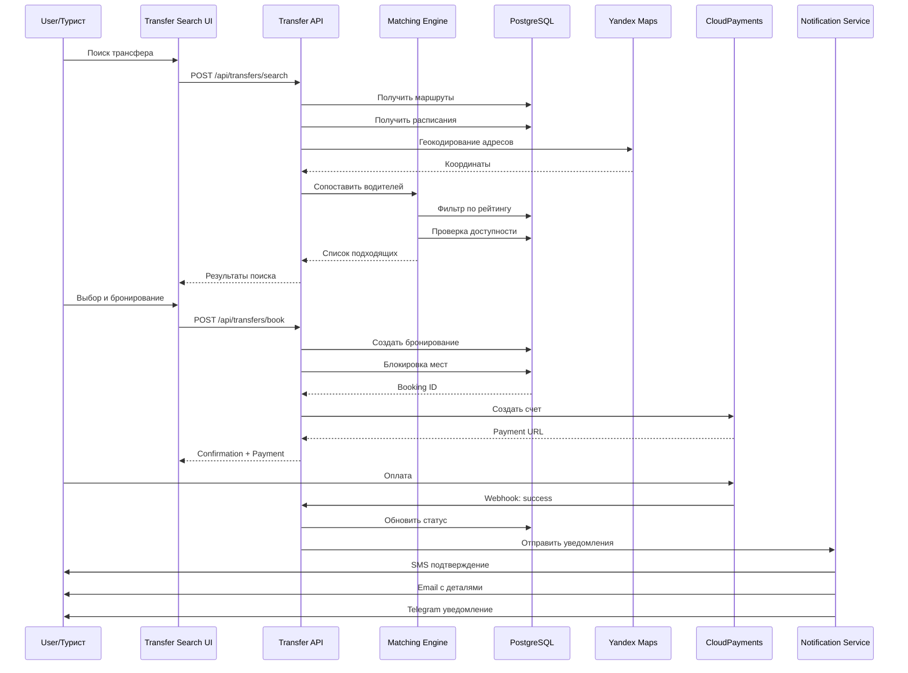

---

## 🤖 АРХИТЕКТУРА AI СИСТЕМЫ

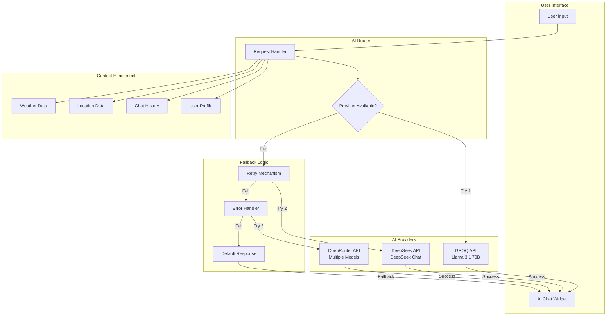

---

## 💳 АРХИТЕКТУРА ПЛАТЕЖНОЙ СИСТЕМЫ

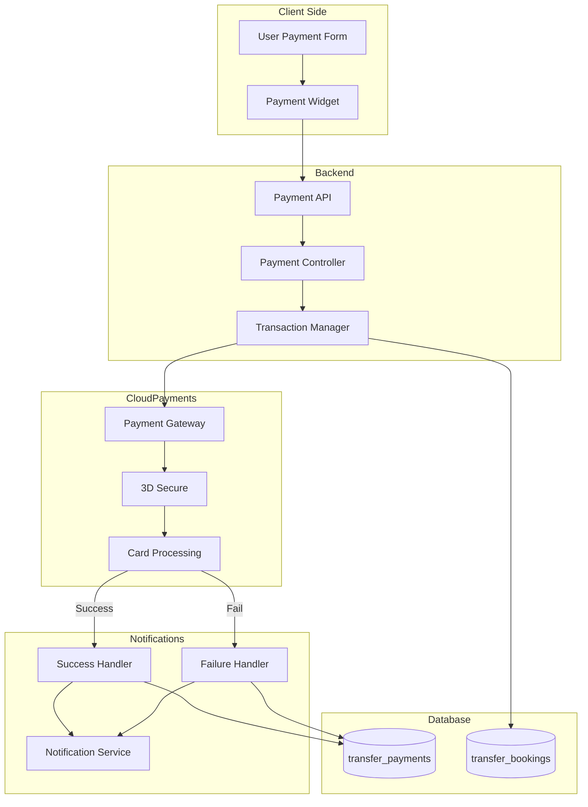

---

## 🎖️ АРХИТЕКТУРА СИСТЕМЫ ЛОЯЛЬНОСТИ

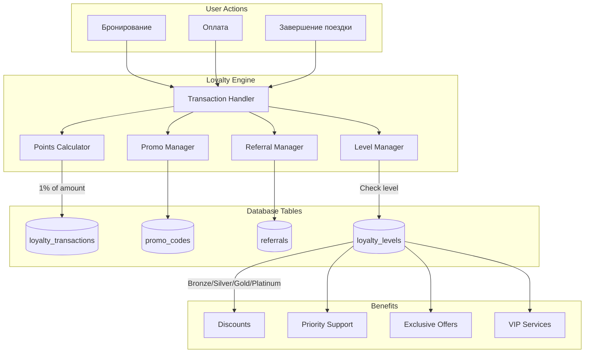

---

## 🔔 АРХИТЕКТУРА СИСТЕМЫ УВЕДОМЛЕНИЙ

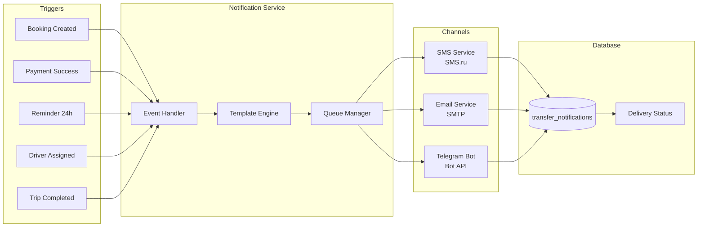

---

## 🗄️ АРХИТЕКТУРА БАЗЫ ДАННЫХ

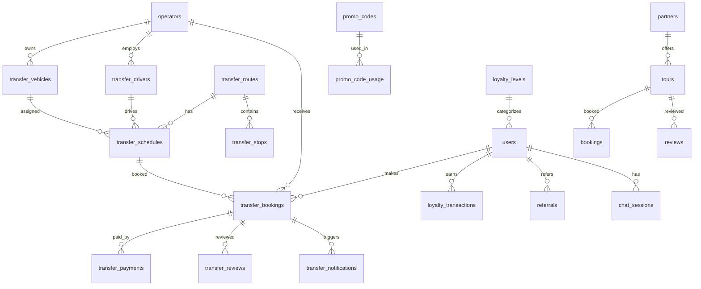

---

## 🔐 АРХИТЕКТУРА БЕЗОПАСНОСТИ

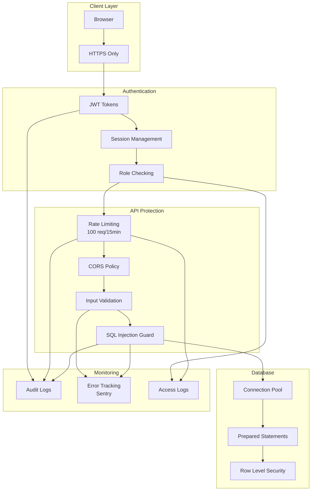

---

## 📊 АРХИТЕКТУРА МОНИТОРИНГА

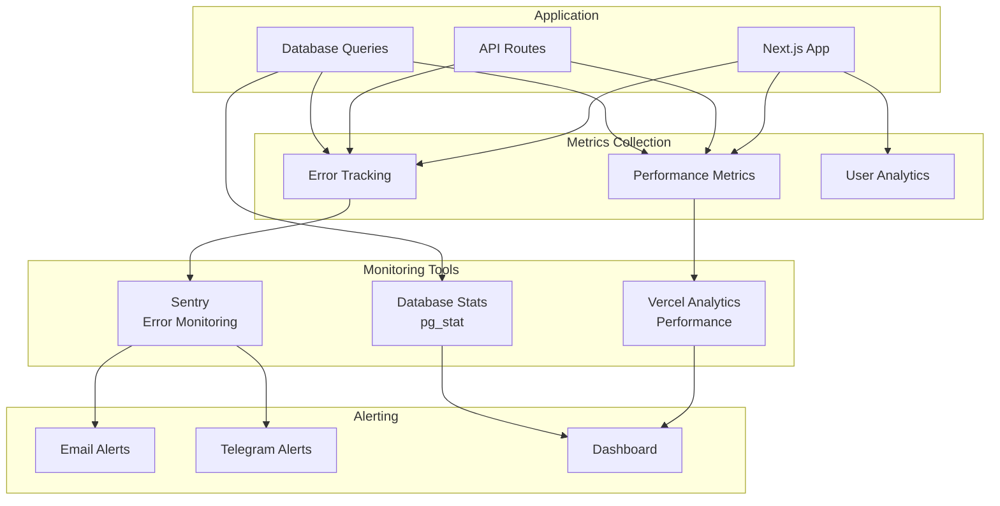

---

## 🚀 DEPLOYMENT АРХИТЕКТУРА

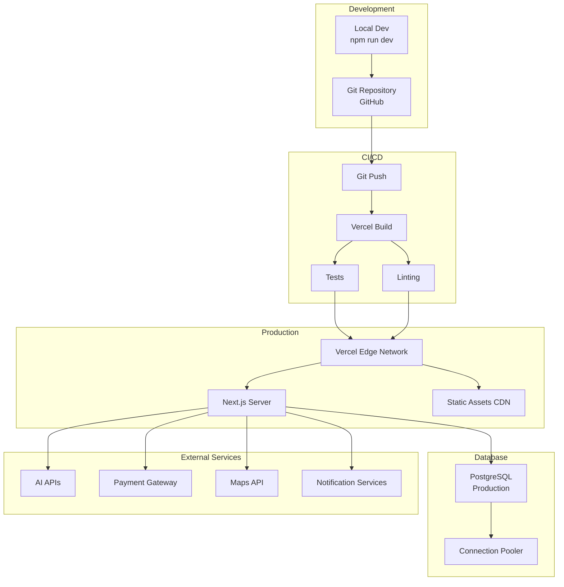

---

## 🔄 DATA FLOW DIAGRAM

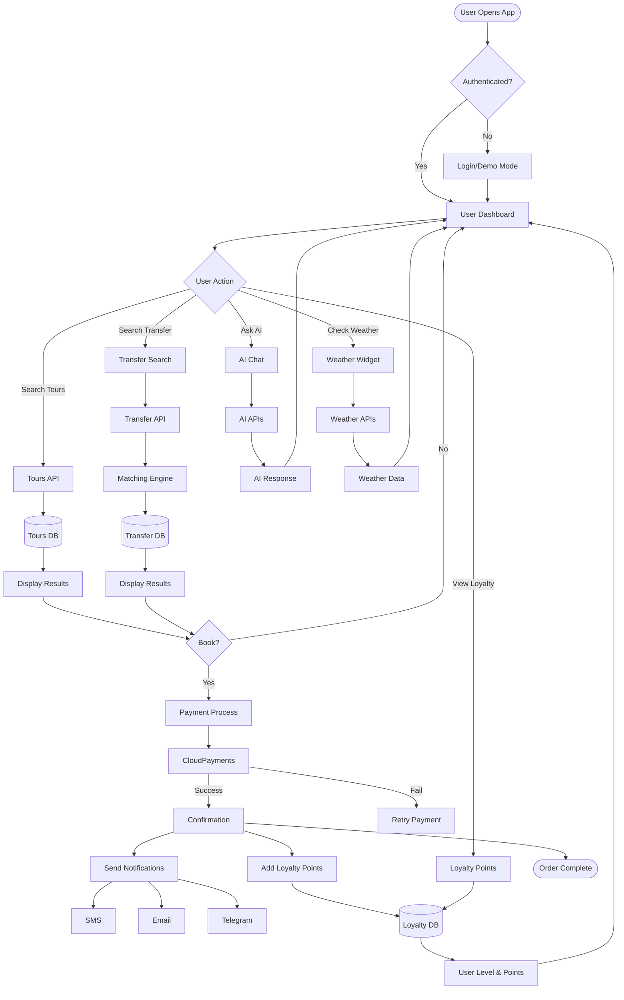

---

## 🏗️ MICROSERVICES STRUCTURE (Future)

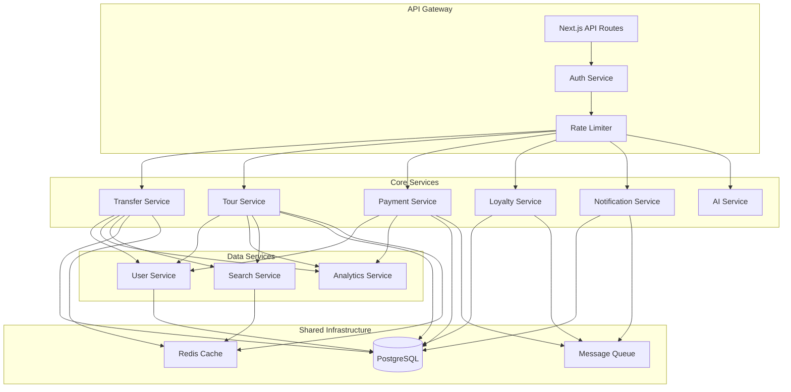

---

## 📱 MOBILE APP ARCHITECTURE (Planned)

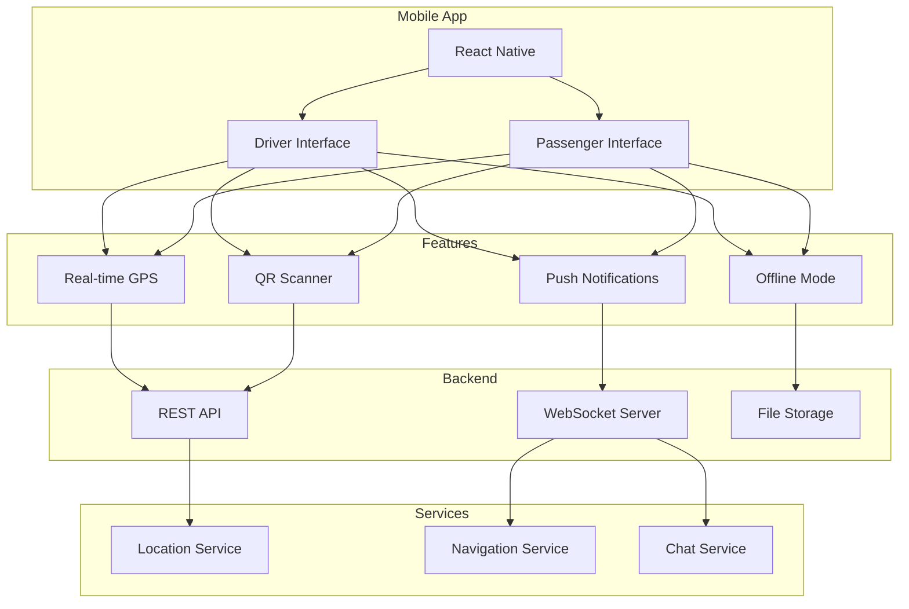

---

## 🎯 SYSTEM INTEGRATION MAP

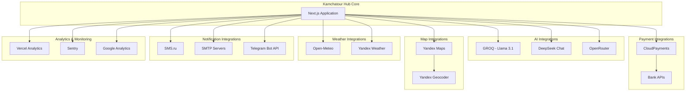

---

## 📈 SCALABILITY ARCHITECTURE

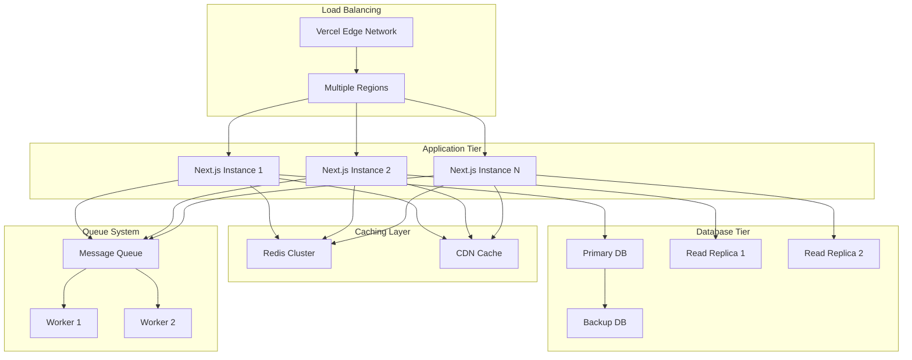

---

## 🔍 MONITORING DASHBOARD STRUCTURE

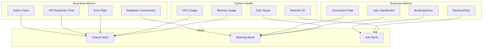

---

## 🎨 UI/UX ARCHITECTURE

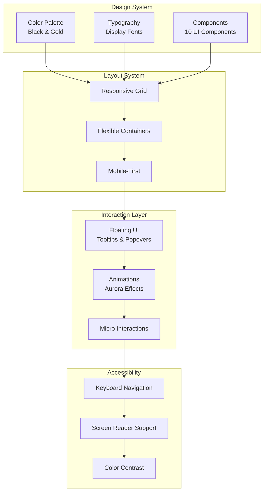

---

## 📊 ЗАКЛЮЧЕНИЕ

### Ключевые архитектурные решения:

1. **Monolithic → Microservices Ready**
   - Текущая монолитная структура может легко эволюционировать в микросервисы
   - Четкое разделение на модули

2. **Serverless-First**
   - Next.js API Routes на Vercel
   - Автоматическое масштабирование
   - Pay-per-use модель

3. **Database-Centric**
   - PostgreSQL как единственный источник истины
   - PostGIS для геоданных
   - Оптимизированные индексы

4. **AI-Powered**
   - Множественные провайдеры с fallback
   - Консенсус-подход для надежности
   - Контекстное обогащение

5. **Integration-Heavy**
   - 10+ внешних сервисов
   - Устойчивость к сбоям
   - Graceful degradation

### Планы развития:

```
Phase 1: Текущая монолитная архитектура ✅
Phase 2: Добавление кэширования (Redis)
Phase 3: Разделение на микросервисы
Phase 4: Kubernetes оркестрация
Phase 5: Multi-region deployment
```

---

**Автор:** Cursor AI Agent  
**Дата:** 30 октября 2025  
**Статус:** ✅ Готово к использованию
